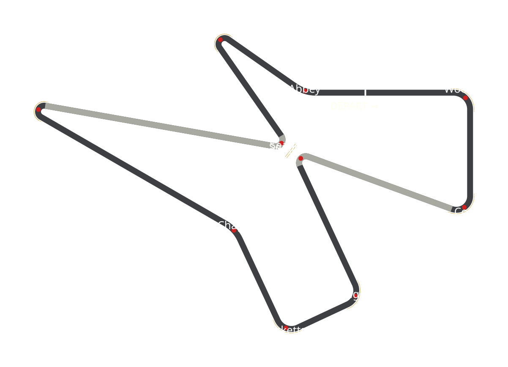
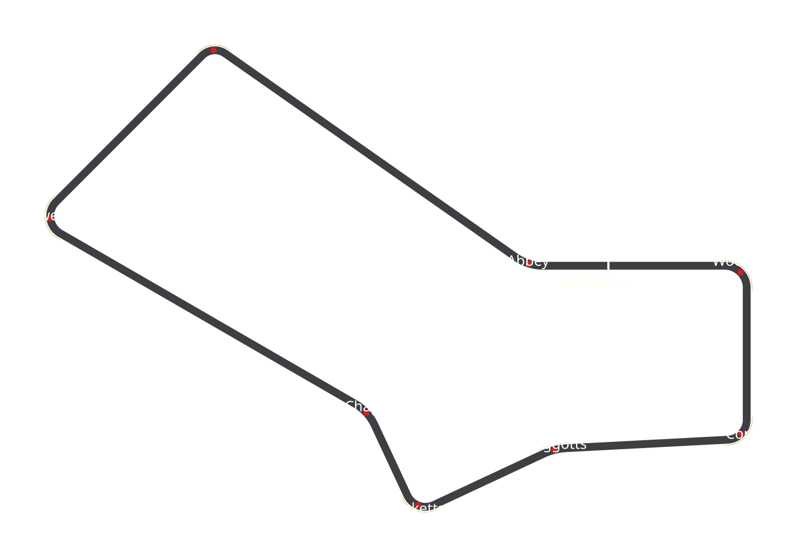
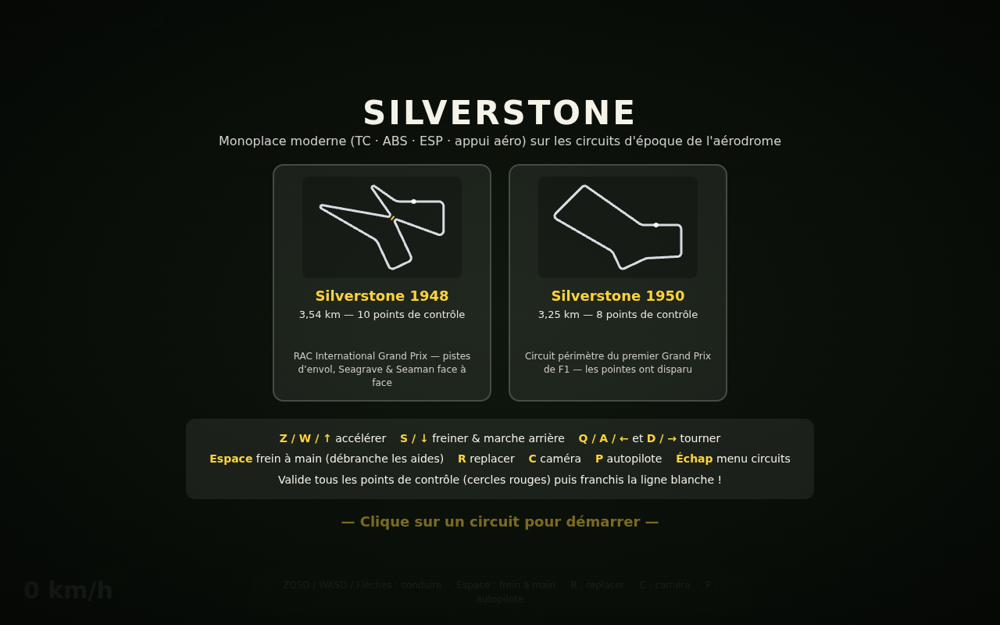
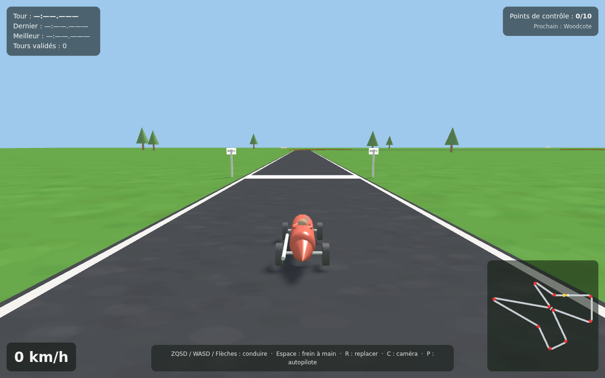
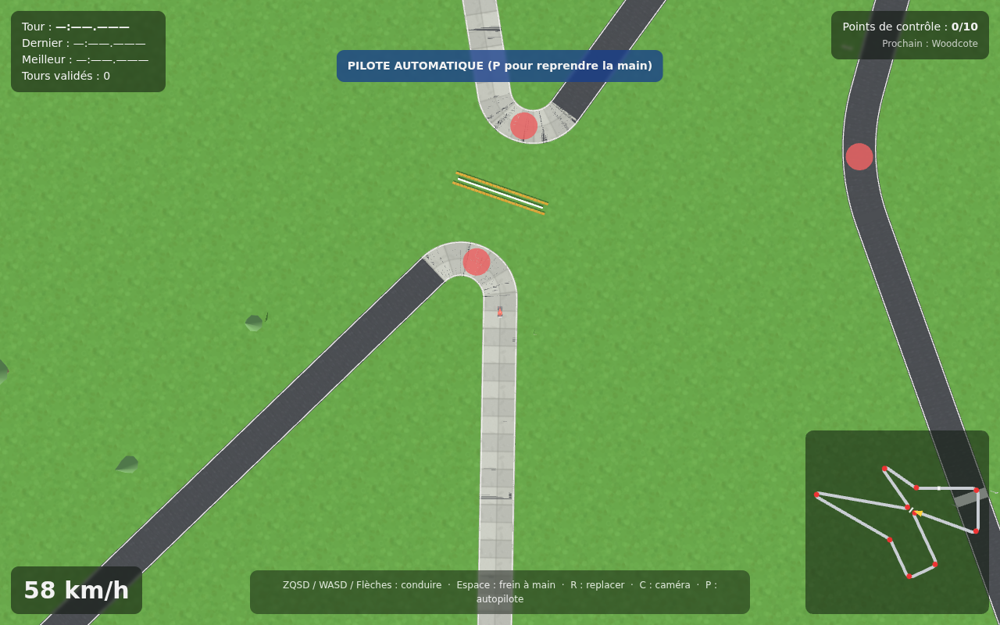

# Silverstone 1948 & 1950 — jeu de course 3D

Un jeu de voiture 3D simple mais réaliste : une **monoplace moderne**
(antipatinage, ABS, ESP, appui aérodynamique) sur les tracés historiques
de Silverstone, au choix dans le **menu de sélection** :

- **Silverstone 1948** (3,54 km) — le circuit du RAC International Grand
  Prix, avec ses deux pointes rentrantes le long des pistes d'envol **en
  dalles de béton**, où **Seagrave** et **Seaman** se font face au
  centre, séparés par un mur blanc et des bottes de foin.
- **Silverstone 1950** (3,25 km) — le circuit périmètre du **premier
  Grand Prix du championnat du monde de F1** (13 mai 1950) : les pointes
  ont disparu, Copse mène directement à Maggotts (devenu un virage à
  gauche), Stowe (droite) mène directement à Club (droite simple). Le
  lieu de départ est identique, sur Farm Straight.

| Silverstone 1948 | Silverstone 1950 |
|---|---|
|  |  |

| Menu de sélection | Dalles de béton (1948) | Seagrave / Seaman (1948) |
|---|---|---|
|  |  |  |

## Jouer

**Option 1 — fichier unique** : ouvrir `silverstone-1948.html` dans un
navigateur (double-clic suffit, tout est inclus, aucune connexion requise).

**Option 2 — version modulaire** : ouvrir `index.html` (double-clic), ou
servir le dossier :

```bash
python3 -m http.server 8000
# puis http://localhost:8000
```

### Commandes

| Touche | Action |
|---|---|
| `Z` / `W` / `↑` | Accélérer |
| `S` / `↓` | Freiner, puis marche arrière |
| `Q` / `A` / `←` et `D` / `→` | Tourner |
| `Espace` | Frein à main (débranche TC + ESP : mode glisse) |
| `R` | Replacer la voiture sur la piste |
| `C` | Caméra (poursuite / capot / ciel) |
| `P` | Pilote automatique (démonstration) |
| `Échap` | Retour au menu de sélection des circuits |

Les touches sont détectées par **position physique** : ZQSD (AZERTY) et
WASD (QWERTY) fonctionnent tous les deux, ainsi que les flèches.

### But du jeu

Valider les **points de contrôle** (10 en 1948, 8 en 1950 — cercles
rouges au sol, affichés pour le débogage, verts une fois validés) dans
l'ordre, puis franchir la **ligne blanche épaisse** sur Farm Straight
pour valider le tour et enregistrer le chrono. Si la voiture quitte la
piste, le bandeau **« Hors-Piste ! »** (fond rouge, texte blanc)
s'affiche en haut au milieu ; au retour sur le bitume il devient vert et
disparaît après 1 seconde.

## Le tracé 1948

Les angles indiqués sont les angles *intérieurs* des virages : le
changement de cap vaut 180° − angle. La somme des changements de cap fait
exactement **360°**, la boucle se referme donc parfaitement :

| # | Virage | Sens | Angle | Changement de cap |
|---|--------|------|-------|-------------------|
| — | Farm Straight (départ) | — | — | — |
| 1 | Woodcote | droite | 90° | 90° |
| 2 | Copse | droite | 70° | 110° |
| 3 | Seagrave | gauche | 45° | 135° |
| 4 | Maggotts | droite | 90° | 90° |
| 5 | Becketts | droite | 90° | 90° |
| 6 | Chapel | gauche | courbe 145° | 35° |
| — | Hangar Straight | — | — | — |
| 7 | Stowe | droite | 20°, bien serré | 160° |
| 8 | Seaman | gauche | 45° | 135° |
| 9 | Club | droite | 20°, bien serré | 160° |
| 10 | Abbey | gauche | courbe 145° | 35° |

Longueur du tour : **3,54 km** (échelle 0,72 appliquée au tracé
historique de ~5,9 km ; largeur de piste 14 m, héritée des pistes de
l'aérodrome). Seagrave et Seaman ne se touchent ni ne se croisent jamais :
leurs apex restent à ~58 m l'un de l'autre, la barrière (mur blanc de
36 m + deux rangées de 25 bottes de foin) est plantée pile au milieu.

Les deux lignes droites **Copse → Seagrave** et **Stowe → Seaman**
empruntent les anciennes pistes d'envol de la RAF : leur sol est en
**dalles de béton** (~7 m, joints apparents), contrairement au reste du
circuit en asphalte.

## Le tracé 1950

Le circuit périmètre du premier GP de F1, dérivé du 1948 : les deux
pointes centrales sont supprimées.

| # | Virage | Sens | Changement de cap |
|---|--------|------|-------------------|
| — | Farm Straight (départ identique) | — | — |
| 1 | Woodcote | droite | 90° |
| 2 | Copse | droite | 87° — mène directement à Maggotts |
| 3 | Maggotts | **gauche** | 22° (kink rapide, R≈108 m) |
| 4 | Becketts | droite | 90° |
| 5 | Chapel | gauche | 35° |
| — | Hangar Straight | — | — |
| 6 | Stowe | droite | 105° — mène directement à Club |
| 7 | Club | droite | 80° (virage simple) |
| 8 | Abbey | gauche | 35° |

Somme des changements de cap : exactement 360°. Pas de barrière ni de
béton : Seagrave et Seaman ont disparu avec les pointes.

## Réalisme

- **Physique** : modèle bicyclette dynamique — dérive des pneus avec
  saturation (ellipse de friction), moteur limité par la puissance *et*
  par l'adhérence, traînée aérodynamique, fusion cinématique à basse
  vitesse. Monoplace moderne : ~720 kg, ~390 ch, 0→100 km/h en ~5 s,
  ~250 km/h en pointe, freinage 229→0 km/h en 116 m.
- **Mécanique moderne — la voiture ne part pas dans tous les sens** :
  - **appui aérodynamique** : l'adhérence augmente avec la vitesse ;
  - **TC (antipatinage)** : le couple envoyé à l'arrière est plafonné à
    l'adhérence restante, impossible de partir en toupie au gaz ;
  - **ABS** : le freinage préserve toujours ~44 % du potentiel avant
    pour continuer à diriger ;
  - **ESP** : un couple de lacet correcteur ramène en permanence la
    rotation vers la trajectoire demandée au volant (testé : dérive
    max 4,3° en braquage maximal à 160 km/h, aucun survirage au lever
    de pied, zigzag brutal rattrapable).
  - `Espace` (frein à main) débranche TC + ESP pour glisser volontairement.
- **Surfaces** : l'herbe divise l'adhérence par plus de deux et freine
  fortement ; dalles de béton et asphalte offrent la même adhérence
  (comme les vraies runways).
- **Collisions** : masques de collision sur **toutes** les bottes de foin
  (cercles) et sur le mur blanc (segment), avec réponse impulsionnelle
  rigide (rebond, friction, rotation induite).

## Architecture

```
index.html            page (menu + HUD + chargement des scripts)
silverstone-1948.html version tout-en-un générée (jouable telle quelle)
js/trackdata.js       registre des circuits (1948, 1950) + géométrie (pur, testable en Node)
js/carphysics.js      physique voiture moderne : TC, ABS, ESP, appui aéro (pur)
js/game.js            règles du jeu : CP, tours, hors-piste, collisions (pur)
js/render3d.js        rendu THREE.js (scène par circuit, voiture, caméras, ombres)
js/hud.js             bannière, chronos, minimap
js/main.js            menu de sélection, boucle, clavier, son moteur
lib/three.min.js      THREE r147 (MIT)
tools/validate.mjs    validation géométrique des deux circuits + aperçus SVG
tools/test-game.mjs   tests physique, stabilité & tours autopilotés (2 circuits)
tools/build-single.mjs assemble le fichier unique
```

Tests (Node ≥ 16, sans dépendance) :

```bash
node tools/validate.mjs    # géométrie : fermeture, non-croisement, CP, bottes…
node tools/test-game.mjs   # physique + tour complet autopiloté + bannière + collisions
node tools/build-single.mjs
```

Anecdote : avec l'ancienne mécanique d'époque, l'autopilote bouclait le
1948 en 2:55.9 — la pole réelle de 1948 tournait autour de 2:56. Avec la
monoplace moderne (TC/ABS/ESP + appui aéro), il descend à **2:04.2** sur
le 1948 et **1:38.7** sur le 1950 : 75 ans de progrès mécanique.
