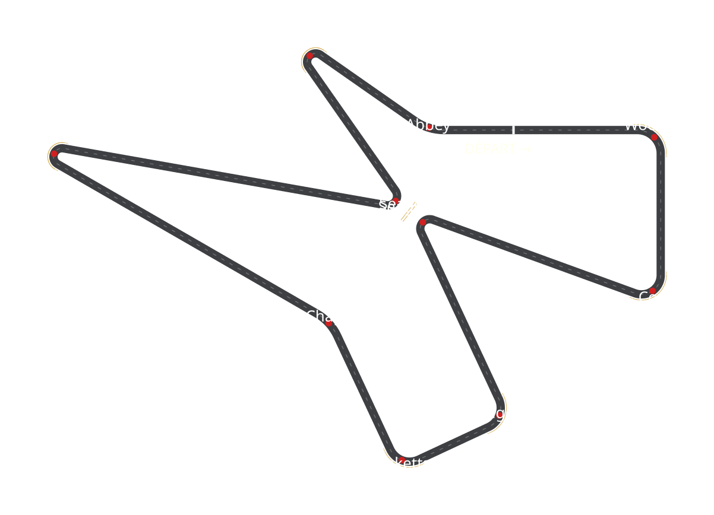

# Silverstone 1948 — jeu de course 3D

Un jeu de voiture 3D simple mais réaliste sur le tracé historique du
**RAC International Grand Prix 1948** à Silverstone : le circuit sur
l'ancien aérodrome, avec ses deux pointes rentrantes le long des pistes
d'envol, où **Seagrave** et **Seaman** se font face au centre — séparés
par un mur blanc et des bottes de foin, comme l'écran de séparation de
l'époque.



| Départ sur Farm Straight | Seagrave / Seaman et leur barrière |
|---|---|
|  |  |

## Jouer

**Option 1 — fichier unique** : ouvrir `silverstone-1948.html` dans un
navigateur (double-clic suffit, tout est inclus, aucune connexion requise).

**Option 2 — version modulaire** : ouvrir `index.html` (double-clic), ou
servir le dossier :

```bash
python3 -m http.server 8000
# puis http://localhost:8000
```

### Commandes

| Touche | Action |
|---|---|
| `Z` / `W` / `↑` | Accélérer |
| `S` / `↓` | Freiner, puis marche arrière |
| `Q` / `A` / `←` et `D` / `→` | Tourner |
| `Espace` | Frein à main (dérapages) |
| `R` | Replacer la voiture sur la piste |
| `C` | Caméra (poursuite / capot / ciel) |
| `P` | Pilote automatique (démonstration) |

Les touches sont détectées par **position physique** : ZQSD (AZERTY) et
WASD (QWERTY) fonctionnent tous les deux, ainsi que les flèches.

### But du jeu

Valider les **10 points de contrôle** (cercles rouges au sol, affichés
pour le débogage — ils deviennent verts une fois validés) dans l'ordre,
puis franchir la **ligne blanche épaisse** sur Farm Straight pour valider
le tour et enregistrer le chrono. Si la voiture quitte la piste, le
bandeau **« Hors-Piste ! »** (fond rouge, texte blanc) s'affiche en haut
au milieu ; au retour sur le bitume il devient vert et disparaît après
1 seconde.

## Le tracé

Les angles indiqués sont les angles *intérieurs* des virages : le
changement de cap vaut 180° − angle. La somme des changements de cap fait
exactement **360°**, la boucle se referme donc parfaitement :

| # | Virage | Sens | Angle | Changement de cap |
|---|--------|------|-------|-------------------|
| — | Farm Straight (départ) | — | — | — |
| 1 | Woodcote | droite | 90° | 90° |
| 2 | Copse | droite | 70° | 110° |
| 3 | Seagrave | gauche | 45° | 135° |
| 4 | Maggotts | droite | 90° | 90° |
| 5 | Becketts | droite | 90° | 90° |
| 6 | Chapel | gauche | courbe 145° | 35° |
| — | Hangar Straight | — | — | — |
| 7 | Stowe | droite | 20°, bien serré | 160° |
| 8 | Seaman | gauche | 45° | 135° |
| 9 | Club | droite | 20°, bien serré | 160° |
| 10 | Abbey | gauche | courbe 145° | 35° |

Longueur du tour : **3,54 km** (échelle 0,72 appliquée au tracé
historique de ~5,9 km ; largeur de piste 14 m, héritée des pistes de
l'aérodrome). Seagrave et Seaman ne se touchent ni ne se croisent jamais :
leurs apex restent à ~58 m l'un de l'autre, la barrière (mur blanc de
36 m + deux rangées de 25 bottes de foin) est plantée pile au milieu.

## Réalisme

- **Physique** : modèle bicyclette dynamique — dérive des pneus avec
  saturation (ellipse de friction), moteur limité par la puissance *et*
  par l'adhérence, freins répartis, traînée aérodynamique, résistance au
  roulement, fusion cinématique à basse vitesse. Monoplace d'époque :
  ~750 kg, ~225 ch, 0→100 km/h en ~6 s, ~210 km/h en pointe.
- **Surfaces** : l'herbe divise l'adhérence par deux et freine fortement.
- **Collisions** : masques de collision sur **toutes** les bottes de foin
  (cercles) et sur le mur blanc (segment), avec réponse impulsionnelle
  rigide (rebond, friction, rotation induite).

## Architecture

```
index.html            page (HUD + chargement des scripts)
silverstone-1948.html version tout-en-un générée (jouable telle quelle)
js/trackdata.js       géométrie du circuit (module pur, testable en Node)
js/carphysics.js      physique voiture (module pur)
js/game.js            règles du jeu : CP, tours, hors-piste, collisions (pur)
js/render3d.js        rendu THREE.js (scène, voiture, caméras, ombres)
js/hud.js             bannière, chronos, minimap
js/main.js            boucle, clavier, son moteur (WebAudio)
lib/three.min.js      THREE r147 (MIT)
tools/validate.mjs    validation géométrique + aperçu SVG
tools/test-game.mjs   tests physique & logique (tour complet en autopilote)
tools/build-single.mjs assemble le fichier unique
```

Tests (Node ≥ 16, sans dépendance) :

```bash
node tools/validate.mjs    # géométrie : fermeture, non-croisement, CP, bottes…
node tools/test-game.mjs   # physique + tour complet autopiloté + bannière + collisions
node tools/build-single.mjs
```

Anecdote : l'autopilote boucle en **2:55.9** — la pole réelle de 1948
(Louis Chiron / Luigi Villoresi selon les sources) tournait autour de
2:56. Coïncidence complète, mais de bon augure.
